# Cinema Network Management

Cinema Network Management is a desktop application for operating a multi-branch cinema business from one shared system. It brings the customer journey and the operational side of the business into the same product: guests can browse movies, buy tickets, watch selected titles online, return purchases, submit complaints, and buy ticket packages, while staff members can manage content, respond to customers, and review business reports.

The goal of the project is not only to sell tickets, but to model how a cinema network actually works day to day. Different user roles see different tools, each focused on a real responsibility inside the organization.

## Project Idea

This system was designed around a simple idea: a cinema network should feel connected.

- Customers should be able to discover movies, complete purchases, and get support without jumping between different tools.
- Content managers should be able to maintain the movie catalogue and update operational details such as showtimes and prices.
- Customer service staff should be able to review complaints and provide responses and compensation.
- Administrators should be able to understand what is happening across the business through reports, requests, and revenue-related views.

In practice, that means the project combines customer-facing flows with staff-facing dashboards in one Java-based client-server application.

## Technologies Used

This project is built as a multi-module Maven application with separate `client`, `server`, and `entities` modules.

- `Java`
- `JavaFX` for the desktop user interface
- `FXML` for view composition
- `CSS` for styling the JavaFX screens
- `Maven` for build and dependency management
- `MySQL` as the database
- `Hibernate / JPA` for persistence and ORM
- `OCSF` style socket-based client-server communication
- `Jakarta Mail` for email-related functionality on the server side

## Architecture Overview

- `client/`
  The JavaFX desktop application used by customers and staff.
- `server/`
  The backend server that handles business logic, database access, reports, and requests.
- `entities/`
  Shared model classes used by both the client and the server.

At runtime, the client connects to the server over a socket connection, the server communicates with MySQL through Hibernate, and shared entity classes are used to move structured data between both sides.

## Main Features

### Customer-facing features

- Browse movies currently available in cinema halls
- Browse online-only movies that can be watched digitally
- View detailed movie information before purchase
- Buy a ticket through a guided seat-selection flow
- Buy and use a multi-entry ticket package
- Return a ticket or purchase link
- Submit a complaint to customer service
- Validate a purchased movie link and watch an online movie

### Content manager features

- View the current movie catalogue
- Add a new movie with metadata, showtime, location, hall, and image
- Add online movies
- Delete movies from the catalogue
- Submit price-change requests
- Update movie showtimes

### Customer service features

- Load unanswered complaints
- Review complaint details
- Write a response
- Send financial compensation when needed

### Administrator features

- Review ticket sales reports
- Review online movie purchase reports
- Review package sales reports
- Review complaint activity
- Review and process movie price-change requests
- Filter reports by month and monitor income

## Screenshots

The screenshots below were added to the repository and reflect the application from different user perspectives.

### Main customer page

The main page is the customer gateway into the system. It presents the current cinema catalogue, highlights upcoming content, and gives direct access to the rest of the guest flows such as online viewing, ticket returns, packages, and complaints.

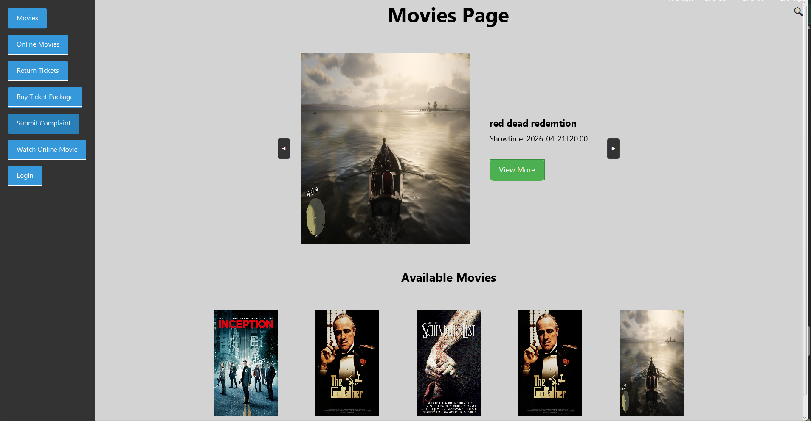

### Buying a movie ticket

The ticket-purchase flow is split into clear steps. The customer first opens a movie details view, then selects a seat, and finally enters the purchase details needed to complete the transaction.

#### Step 1: Movie details and purchase options

This screen shows the selected movie in detail and gives the customer two purchase paths: a regular ticket purchase or entry through an existing package card.

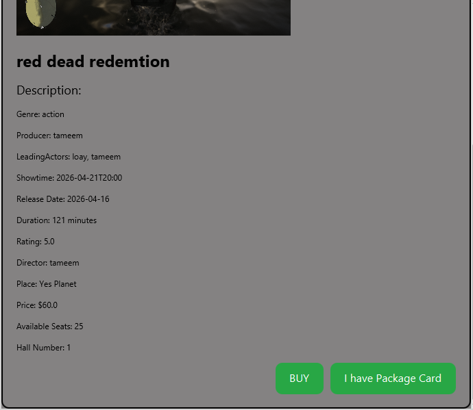

#### Step 2: Seat selection

After choosing to buy, the user selects an available seat from the hall layout. This keeps the purchase process visual and easy to follow.

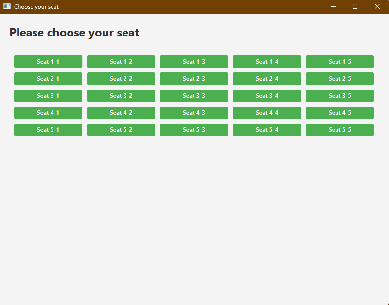

#### Step 3: Entering payment details

The final step collects the customer details required to complete the booking and generate the purchase record.

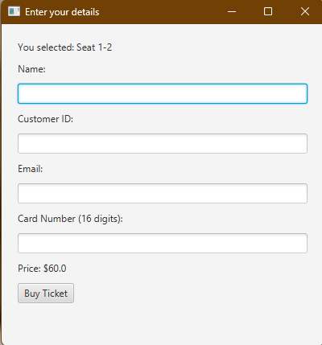

### Online movies

The online movies page is dedicated to titles that are not being watched inside a physical theater hall. These movies can be purchased as digital viewing links and watched remotely through the online flow.


### Return ticket

Customers can return an existing purchase by providing the order details and specifying whether the item is a regular purchase card or an online purchase link.

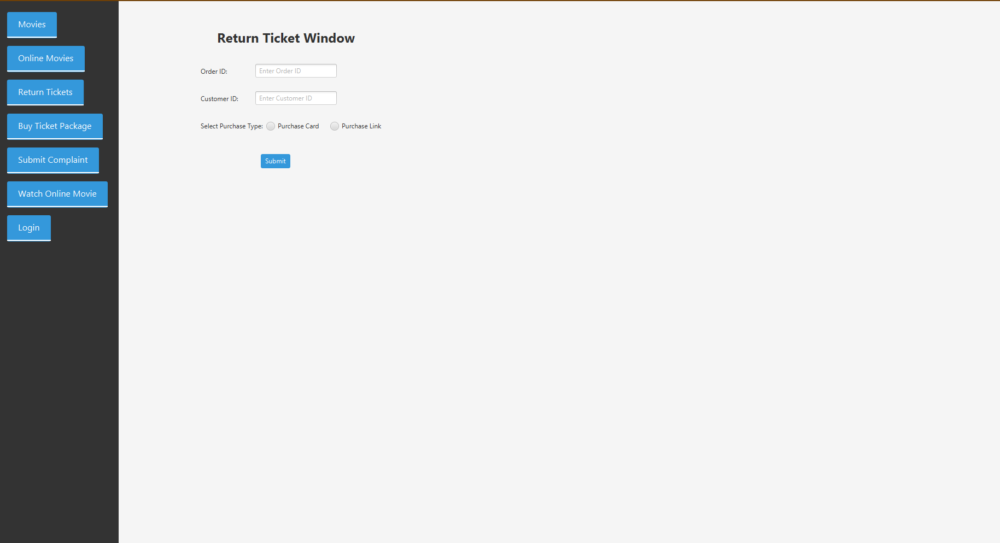

### Buy ticket package

The package feature allows customers to buy multiple future entries in advance. This is useful for frequent visitors who want a reusable package instead of paying for each visit separately.

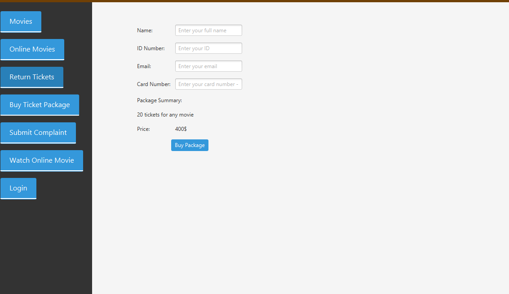

### Submit complaint

The complaint page gives customers a direct communication channel with the cinema network. Users can enter their contact details, describe the issue, choose a branch, and submit the complaint for follow-up by customer service.

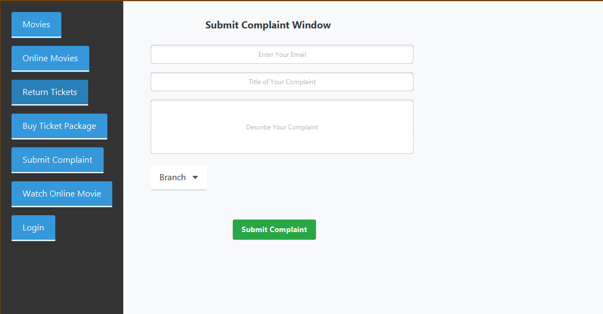

### Content manager dashboard

The content manager dashboard is the control center for maintaining the movie catalogue. From here, the manager can add movies, add online titles, delete items, update prices, and update showtimes.

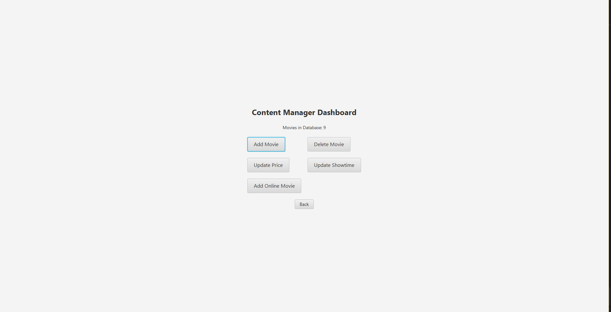

### Adding a movie

This screen is an example of the content-management workflow in action. It captures the information needed to publish a new movie into the system, including title, staff credits, schedule, hall, location, pricing, artwork, and description.

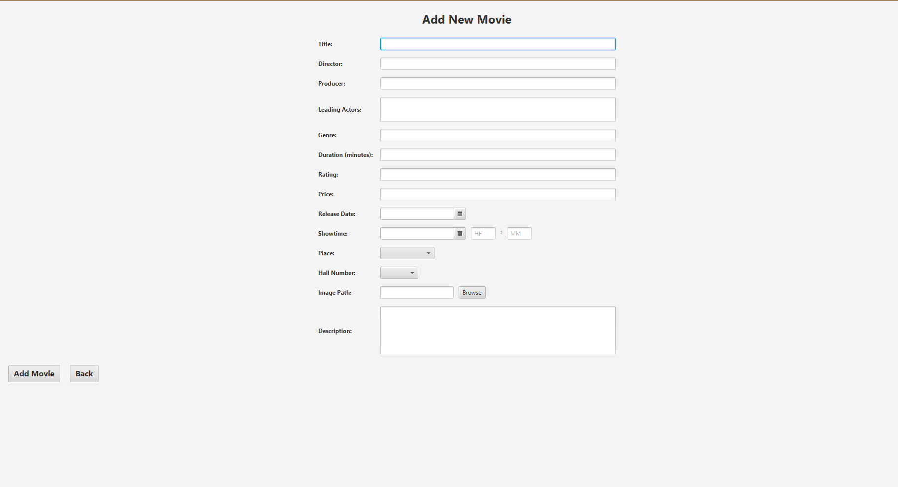

### Admin dashboard

The admin dashboard acts as the entry point to the reporting and decision-making side of the system. It groups together ticket reports, online movie reports, package reports, complaints, and price-change requests.

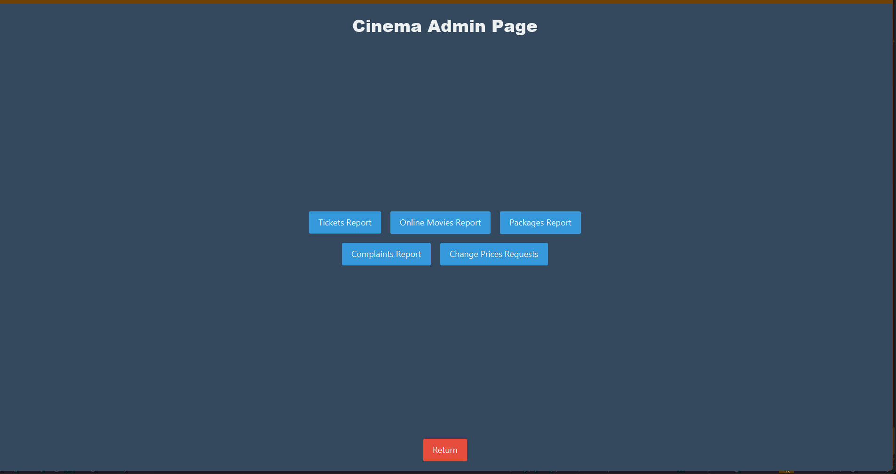

### Admin report example: ticket sales

This report gives administrators a structured view of sold tickets, including movie title, branch, purchase date, customer details, and monthly income totals.

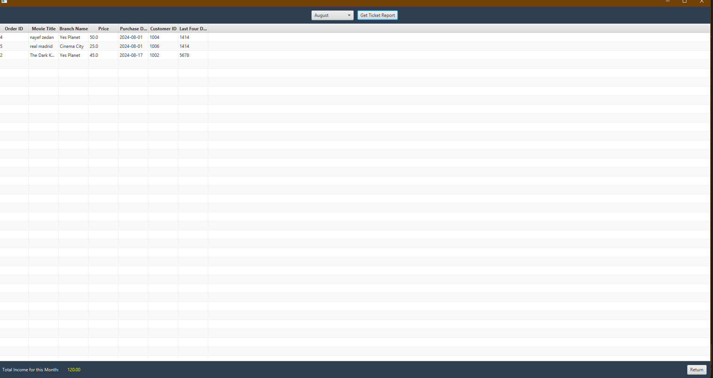

### Admin report example: price change requests

This screen shows how pricing governance is handled in the system. Content managers can submit requests, and administrators can review them before approving or denying changes.

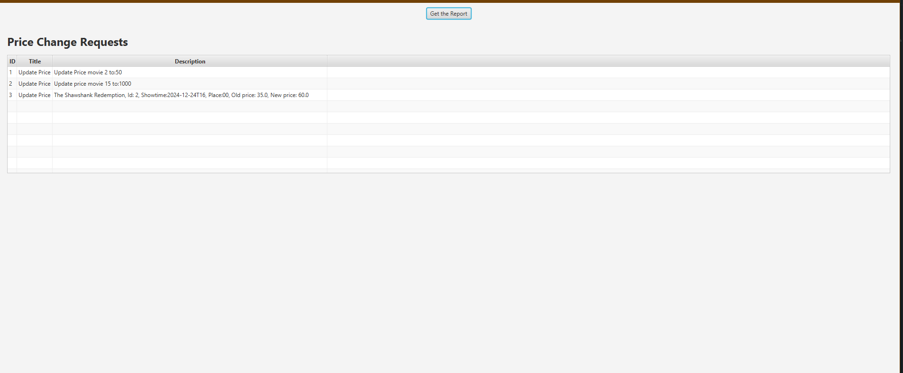

## User Roles

The project supports multiple roles, each with a different responsibility in the cinema network:

- `Guest / Customer`
  Browses movies, buys tickets, watches online movies, returns purchases, buys packages, and submits complaints.
- `Content Manager`
  Maintains the movie catalogue and handles operational movie updates.
- `Customer Service`
  Reviews unresolved complaints and answers customers with compensation when appropriate.
- `Admin`
  Reviews reports, oversees business activity, and handles approval-oriented tasks such as price-change requests.

## Running the Project

### Prerequisites

- Java
- Maven
- MySQL

### Database configuration

The server uses the configuration in `server/src/main/resources/hibernate.properties`.

By default, the project is configured with:

- database: `avTepos`
- host: `localhost:3306`
- username: `root`
- password: `admin`

Important note: the current Hibernate setting is `hibernate.hbm2ddl.auto = create`, which recreates the schema when the server starts.

### Build

```bash
mvn clean install
```

### Run the server

```bash
mvn -pl server exec:java
```

The server starts on port `3000`.

### Run the client

```bash
mvn -pl client javafx:run
```

When the client opens, connect using:

- Host: `localhost`
- Port: `3000`

## Why This Project Stands Out

What makes this project interesting is that it is not limited to a single cinema screen or a single user type. It models a broader cinema ecosystem:

- customer discovery and booking
- online movie access
- package-based repeat attendance
- complaint handling and customer support
- catalogue management
- branch-aware reporting and administrative review

In other words, it treats a cinema as an operating business, not just a movie list with a buy button.
